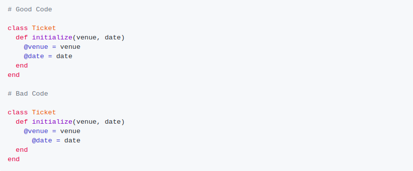
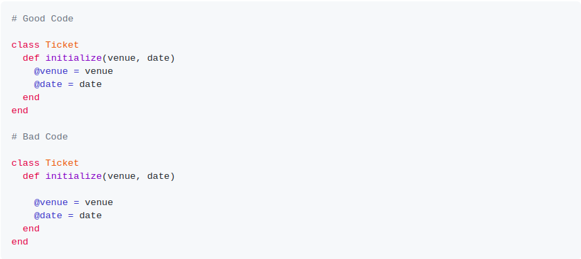
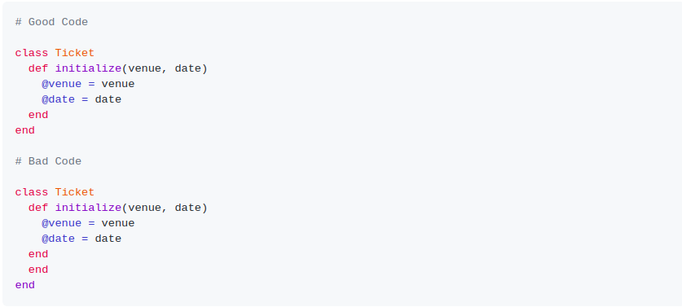
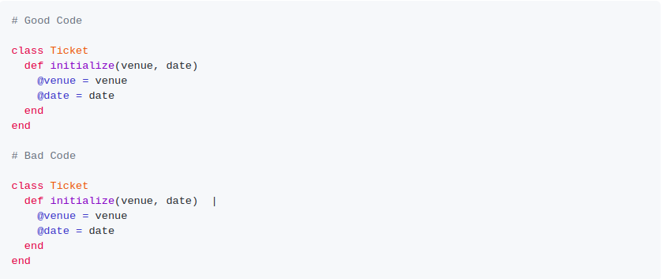

# ruby_capstone- linters for Ruby

Its a customised linter for ruby.The whole idea of writing code to check another code is intriguing at the same time cognitively demanding. Building Linters for Ruby, the project provides feedback about errors or warning in code. The project was built completely with Ruby following all possible best practices. Rubocop was used as a code-linter alongside Gitflow to ensure I maintain good coding standards.

## About the Customized Linter

It checks following style errors:
checks for empty lines at the beginning
trailing spaces
proper indentation
suggestion of good coding practices such as use of 'each', 'until' over 'for'
open ends

## Getting Started

To install dependencies, add 'bundle install' 
To clone the repository please run the following commands on your terminal:

$ cd folder-name
  
  $ git clone https://github.com/karvel-code/Ruby-Capstone
  
 ## To run this linter on a file:
 
 $ ./bin/main filename e.g. bin/main lib/example.rb

 ## To test the file:

 run following command from the root folder:
 $ rspec

 ## Indentation Error
 
 

 ## Empty Line error
 
 
 
 ## Missing Unexpeted end
 
 

 ## Trailing Spaces
 
 

## Built with

Ruby

# Authors

👤 Elvis Githinji

Github: [@karvel-code](https://github.com/karvel-code)

Linkedin: [@Elvis Githinji](https://www.linkedin.com/in/elvis-githinji-9a5032164/)

# Contributing

Contributions, issues, and feature requests are welcome!

Feel free to check the [@issues page.](https://github.com/karvel-code/Ruby-Capstone/issues)

# 🤝 Show your support

Give a ⭐️ if you like this project!

# 📝 License

This project is [@MIT](https://github.com/git/git-scm.com/blob/master/MIT-LICENSE.txt) licensed.